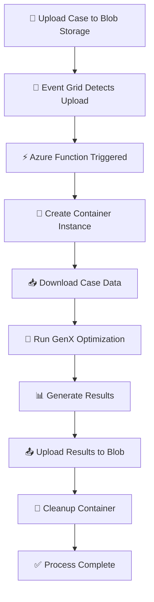

# 🚀 GenX Azure Event Grid Automation - Complete Workflow Guide

## 🎯 What We've Built

You now have a **fully automated GenX processing pipeline** that:

1. **📤 Monitors blob storage** for new GenX case uploads
2. **🔥 Automatically triggers** container processing via Event Grid
3. **🏃 Runs GenX optimization** in isolated Azure Container Instances
4. **📥 Uploads results** back to blob storage automatically
5. **🧹 Cleans up** resources when complete

## 📁 Complete File Structure

```
GenX.jl/
├── 🐳 Container Images
│   ├── Dockerfile                    # Original GenX container
│   └── Dockerfile.eventgrid          # Enhanced Event Grid container
│
├── ⚡ Azure Function (Event Grid Trigger)
│   ├── azure-function/
│   │   ├── function_app.py          # Event processing logic
│   │   ├── requirements.txt         # Python dependencies
│   │   └── host.json               # Function configuration
│
├── 🛠️ Management Scripts
│   ├── scripts/
│   │   ├── setup_event_grid.sh     # Initial Azure setup
│   │   ├── monitor_deployment.sh   # System monitoring
│   │   ├── run_genx_case.py        # Enhanced GenX runner
│   │   ├── azure_blob_utils.py     # Blob storage utilities
│   │   └── validate_setup.py       # Setup validation
│
├── 🔄 CI/CD Pipeline
│   ├── .github/workflows/
│   │   ├── docker-test.yml         # Original container testing
│   │   └── eventgrid-deploy.yml    # Event Grid deployment
│
└── 📚 Documentation
    └── EVENT_GRID_README.md         # Detailed setup guide
```

## 🚀 Quick Start Guide

### Step 1: Deploy Infrastructure

```bash
# Run the setup script (creates all Azure resources)
./scripts/setup_event_grid.sh
```

This creates:
- ✅ Resource Group (`genx-rg`)
- ✅ Storage Account (`genxstorage`) with containers
- ✅ Function App (`genx-eventgrid-function`) 
- ✅ Event Grid subscription
- ✅ Container Registry integration
- ✅ All required permissions

### Step 2: Deploy Function Code

```bash
# Install Azure Functions Core Tools (if not already installed)
npm install -g azure-functions-core-tools@4 --unsafe-perm true

# Deploy the function
cd azure-function
func azure functionapp publish genx-eventgrid-function
```

### Step 3: Test the System

```bash
# Upload a test case and monitor processing
./scripts/monitor_deployment.sh test

# Watch the logs in real-time
./scripts/monitor_deployment.sh logs
```

### Step 4: Use with Real Cases

```bash
# Upload your GenX case
az storage blob upload-batch \
  --destination "cases/my_case_name" \
  --source "./path/to/your/case" \
  --account-name genxstorage

# Monitor processing
./scripts/monitor_deployment.sh status

# Download results when complete
az storage blob download-batch \
  --destination "./results" \
  --source "results/my_case_name" \
  --account-name genxstorage
```

## 🔄 Complete Processing Flow



## 🎯 Key Features

### 🔒 **Secure & Scalable**
- Managed identities for authentication
- Auto-scaling container instances
- Resource isolation per case

### 💰 **Cost Optimized**
- Pay-per-use pricing model
- Automatic resource cleanup
- Efficient container packing

### 📊 **Monitoring & Management**
- Real-time processing logs
- Status monitoring endpoints
- Automated error handling

### 🔄 **CI/CD Integration**
- Automated container builds
- GitHub Actions deployment
- Version-controlled infrastructure

## 🛠️ Management Commands

```bash
# System Status
./scripts/monitor_deployment.sh status

# Stream Logs
./scripts/monitor_deployment.sh logs

# List Active Jobs
./scripts/monitor_deployment.sh containers

# Clean Completed Jobs
./scripts/monitor_deployment.sh clean

# Test System
./scripts/monitor_deployment.sh test

# List Results
./scripts/monitor_deployment.sh results
```

## 📊 Monitoring Endpoints

- **Function Status**: `https://genx-eventgrid-function.azurewebsites.net/api/status`
- **Azure Portal**: Monitor containers and function executions
- **Storage Explorer**: Browse uploaded cases and results

## 🎯 Use Cases

### 1. **Batch Processing**
Upload multiple cases and let the system process them automatically:

```bash
# Upload multiple cases
for case in case1 case2 case3; do
    az storage blob upload-batch \
      --destination "cases/$case" \
      --source "./$case" \
      --account-name genxstorage
done
```

### 2. **Research Workflows**
Integrate with research pipelines for automated sensitivity analysis:

```bash
# Generate cases programmatically and upload
python generate_cases.py | while read case_dir; do
    az storage blob upload-batch \
      --destination "cases/$(basename $case_dir)" \
      --source "$case_dir" \
      --account-name genxstorage
done
```

### 3. **External Integration**
Trigger processing from external systems:

```bash
# Using the blob utilities
python3 scripts/azure_blob_utils.py upload \
  --account-name genxstorage \
  --container cases \
  --local-path "./my_case" \
  --blob-prefix "automated_case_$(date +%Y%m%d_%H%M%S)"
```

## 🔧 Configuration Options

### Container Resources
Adjust in `azure-function/function_app.py`:
```python
resources=ResourceRequirements(
    requests=ResourceRequests(
        memory_in_gb=8.0,    # Adjust memory
        cpu=4.0              # Adjust CPU cores
    )
)
```

### Processing Timeout
Modify in container command:
```bash
timeout 3600  # 1 hour timeout
```

### Storage Containers
- `cases/` - Input GenX cases
- `results/` - Output results and summaries

## 🚨 Troubleshooting

### Common Issues

1. **Event Grid not triggering**:
   ```bash
   # Check subscription
   az eventgrid event-subscription list --source-resource-id /subscriptions/{sub}/resourceGroups/genx-rg/providers/Microsoft.Storage/storageAccounts/genxstorage
   ```

2. **Container creation fails**:
   ```bash
   # Check function logs
   az functionapp log tail --name genx-eventgrid-function --resource-group genx-rg
   ```

3. **GenX processing errors**:
   ```bash
   # Check container logs
   az container logs --name {container-name} --resource-group genx-rg
   ```

### Debug Commands
```bash
# Validate setup
python3 scripts/validate_setup.py

# Test blob utilities
python3 scripts/azure_blob_utils.py list --account-name genxstorage --container cases

# Check system status
./scripts/monitor_deployment.sh status
```

## 📈 Performance & Scaling

### Current Limits
- **Memory**: 8GB per container
- **CPU**: 4 cores per container  
- **Timeout**: 1 hour per case
- **Concurrent**: Limited by Azure quotas

### Scaling Options
- Increase container resources for larger cases
- Implement queue-based processing for high volumes
- Deploy across multiple regions for global access
- Add auto-scaling based on queue depth

## 🔐 Security Features

- **Managed Identity**: No stored credentials
- **RBAC**: Least-privilege access model
- **Network Isolation**: VNet integration available
- **Audit Logs**: Complete processing trail

## 💡 Next Steps & Extensions

1. **Notification System**: Add email/webhook notifications
2. **Advanced Monitoring**: Application Insights integration
3. **Multi-Region**: Deploy across Azure regions
4. **Queue Management**: Handle high-volume scenarios
5. **Custom Validation**: Add case validation logic
6. **Result Processing**: Automated analysis of outputs

## 🎉 Summary

You now have a **production-ready**, **scalable**, and **automated** GenX processing pipeline that:

✅ **Eliminates manual intervention** - Upload and forget  
✅ **Scales automatically** - Handles multiple cases concurrently  
✅ **Integrates with CI/CD** - Version-controlled and automated  
✅ **Provides monitoring** - Real-time status and logging  
✅ **Optimizes costs** - Pay only for actual processing time  
✅ **Ensures reliability** - Error handling and automatic cleanup  

The system is ready for production use and can handle everything from single case studies to large-scale batch processing workflows! 🚀
